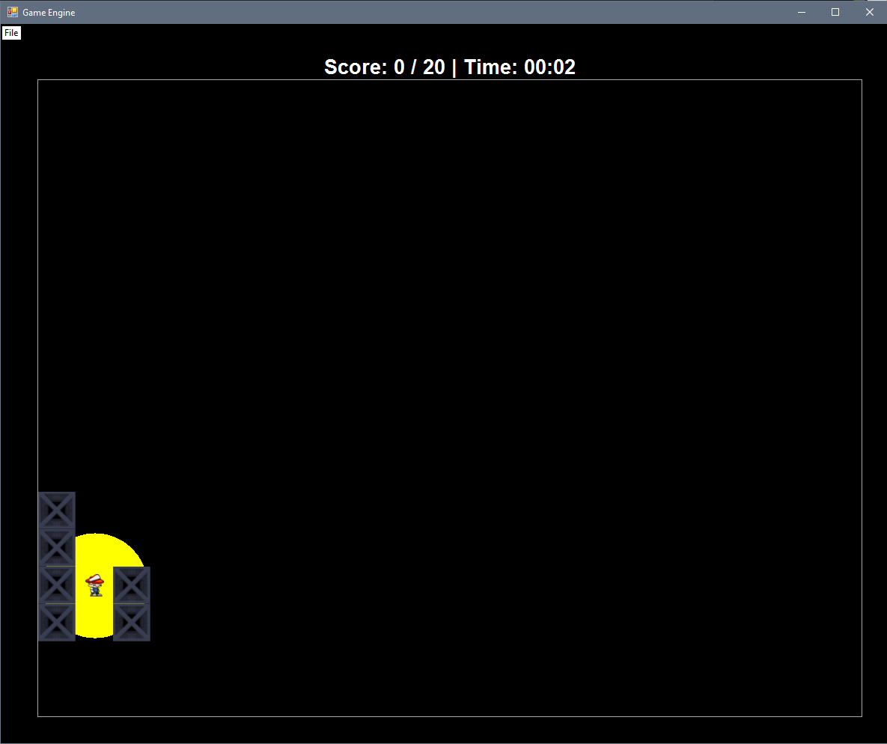
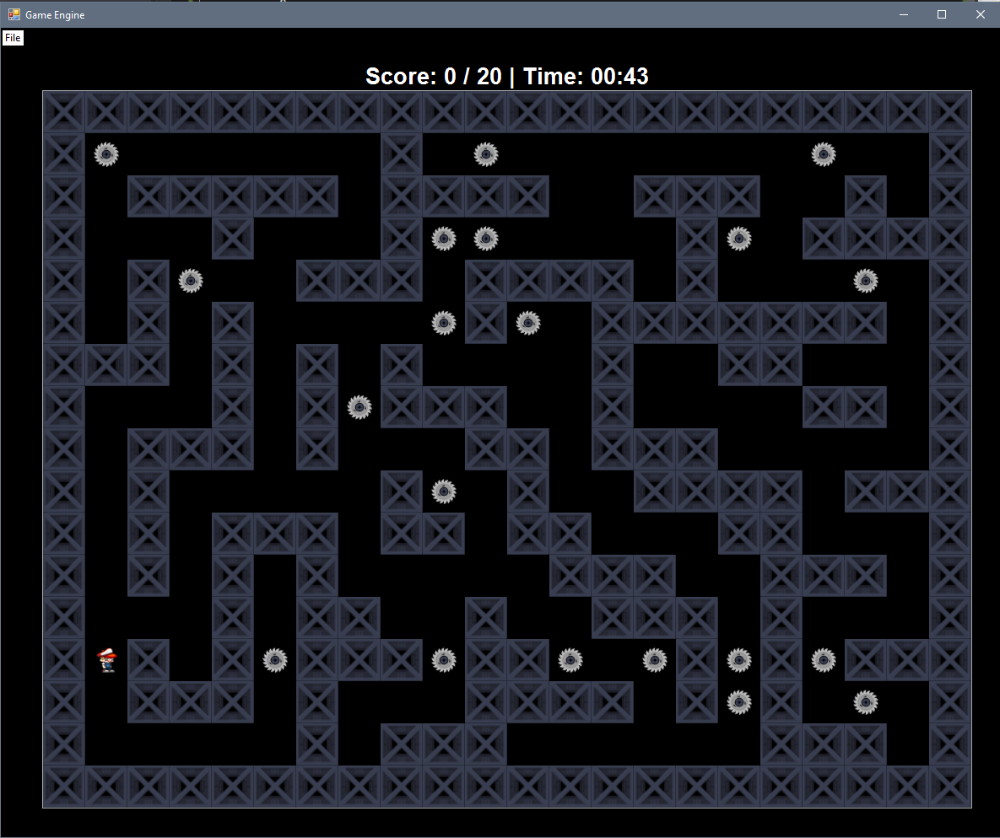

# 🎰 Game Engine 🚀

A simple game engine is written in C#. It is created in the .Net Full Framework version since it needs Windows Forms and Windows Api for this game.
This is my first try creating a simple game engine and it turned out pretty good in my opinion. 🚗😀

The game goal is to collect all the coins in the shortest time possible. Each new game recreates the coins and player in different locations. When all coins are collected, time stops. ⏰

## Commands 🕹

- Go Up: `Up arrow` or `W`
- Go Down: `Down arrow` or `S`
- Go Left: `Left arrow` or `A`
- Go Right: `Right arrow` or `D`
- Sprint: `Shift`

## Menu 📝

Menu has 4 options:
- New game
- Pause / Resume
- Show map
- Exit

### Game mods 🎮

Game has two modes
- **Flashlight mode** - player can only see a small part of a screen
- **Show map mode** - whole map becomes visible

## Flashlight mode

## Show map mode

